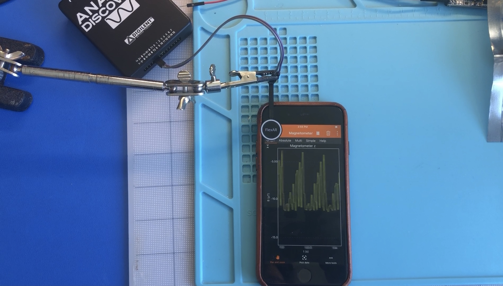
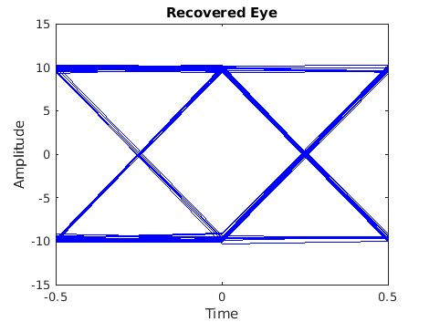
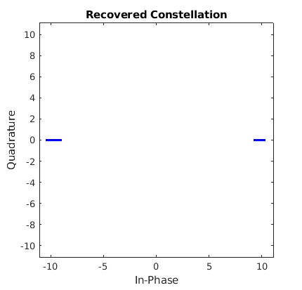
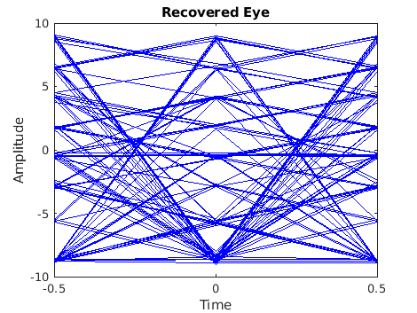
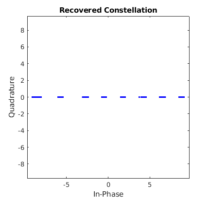

# Proto-Magnetic-Comms
Proof of concept for transmitting data over a magnetic channel

The design is based around an iPhone magnetometer acting as a receiver, capturing data using an app that records it as a CSV file. Matlab is then used for offline processing of the data to recover the transmitted symbols. A script is used to import the data and perform signal processing to recover the transmitted symbols.

The transmitter is built using an Analog Discovery as a waveform generator outputting to a FlexAR magnetic coil to generate the modulated magnetic waveform.

A full description of the algorithm and my process of creating it can be found on my blog.

[Tea and Tech Time: Magnetic Communications](https://teaandtechtime.com/magnetic-communications/)

## Prototype Requirements
- iPhone and Phyphox app
- Analog Discovery and Waveforms application
- FlexAR Coil
- Matlab 2020 or greater

## NRZ Recovered Results

## PAM-8 Recovered Results

